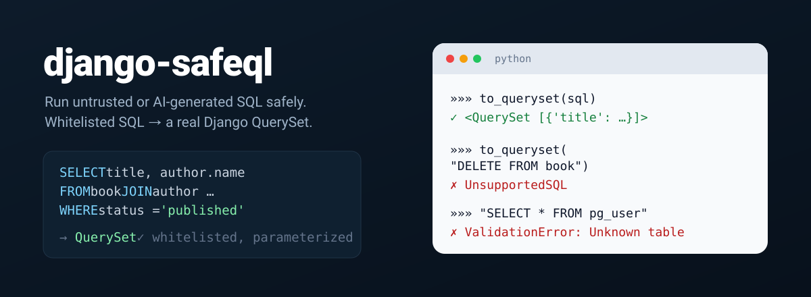

<p align="center">
  
</p>

<p align="center">
  <a href="https://pypi.org/project/django-safeql/"></a>
  <a href="https://github.com/lpauloin/django-safeql/actions/workflows/ci.yml"></a>
  
  
  
</p>

# django-safeql

A whitelisted SQL-to-QuerySet transpiler for Django.

`django-safeql` takes a restricted subset of SQL, validates it against a
schema you declare (which tables, columns, functions and operators are
allowed), and compiles it straight into a real Django `QuerySet`. No raw SQL
ever reaches the database. It's built for cases where a query comes from an
untrusted or semi-trusted source, such as an LLM answering questions over
your data, an end-user query box, or a saved-report feature, and still has
to run safely against your existing models on PostgreSQL, SQLite or MySQL.

- **No SQL injection surface.** The input is parsed into an AST and compiled
  to ORM calls. Every value becomes a bound parameter, and nothing is ever
  executed as a raw string.
- **Whitelist by construction.** Only the tables, columns, operators,
  functions and aggregates you declare are reachable. Anything else is
  rejected before it gets near the database.
- **One SQL, many backends.** The same query compiles to a `QuerySet` that
  runs on PostgreSQL, SQLite or MySQL. A feature a backend can't run is
  rejected up front instead of being silently mis-translated.
- **Real QuerySets out.** The result is an ordinary Django `QuerySet`, so it
  composes with everything else in your app (pagination, further
  `.filter()`, `select_related`, and so on).

## Install

```bash
pip install django-safeql
```

Requires Django ≥ 4.2. PostgreSQL is the default target and supports the full
feature set; SQLite runs the portable subset (see
[Database targets](#database-targets)).

## Quickstart

```python
from django_safeql import SQLTranspilerSchema, TableSchema, JsonFieldSchema, SQLToQuerySetTranspiler
from myapp.models import Book, Author

schema = SQLTranspilerSchema(
    base_table="book",
    base_queryset=Book.objects.all(),
    tables={
        "book": TableSchema(
            queryset=Book.objects.all(),
            relation="",
            allowed_fields={"id", "title", "status", "author_id", "pages", "details"},
            json_fields={
                "details": JsonFieldSchema(schema={
                    "type": "object",
                    "properties": {
                        "language": {"type": "string"},
                        "edition": {"type": "integer"},
                    },
                }),
            },
        ),
        "author": TableSchema(
            queryset=Author.objects.all(),
            relation="author",
            allowed_fields={"id", "name"},
        ),
    },
    max_limit=1000,
)

transpiler = SQLToQuerySetTranspiler(schema)

queryset = transpiler.to_queryset("""
    SELECT book.title, author.name
      FROM book
      JOIN author ON book.author_id = author.id
     WHERE book.status = 'published'
       AND book.details->>'language' = 'en'
     ORDER BY book.pages DESC
     LIMIT 20
""")

list(queryset)  # a normal QuerySet, evaluate it however you like
```

Anything outside the declared schema is rejected before touching the
database:

```python
transpiler.to_queryset("SELECT * FROM pg_catalog.pg_user")
# django_safeql.ValidationError: Unknown table: pg_user

transpiler.to_queryset("DELETE FROM book WHERE id = 1")
# django_safeql.UnsupportedSQL: ...
```

## How it works

`SQLToQuerySetTranspiler` runs SQL through four stages:

1. **Parse.** `sqlglot` parses the SQL text (Postgres dialect) into an
   internal AST.
2. **Annotate.** Every column, join and function call is resolved against
   your `SQLTranspilerSchema` (including JSON Schema-typed JSON fields).
3. **Validate.** Anything not explicitly whitelisted (unknown table,
   disallowed function, unsupported syntax, LIMIT above your ceiling, and so
   on) raises `ValidationError` or `UnsupportedSQL`.
4. **Codegen.** The validated AST is compiled into Django ORM constructs
   (`Q`, `F`, `Case`/`When`, `Subquery`, `Exists`, aggregates, JSON key
   transforms, casts, date truncation) and returned as a `QuerySet`.

## What's supported

- `SELECT` / `WHERE` / `JOIN` / `GROUP BY` / `HAVING` / `ORDER BY` / `LIMIT`
- Comparison, boolean and arithmetic operators
- Scalar aggregates (`COUNT`, `SUM`, `AVG`, `MIN`, `MAX`) and collection
  aggregates (`ARRAY_AGG`, `STRING_AGG`, `JSON_AGG`, `JSON_OBJECT_AGG`)
- String functions (`LOWER`, `UPPER`, `TRIM`, `SUBSTRING`, `CONCAT`, `LEFT`,
  `RIGHT`, `REPEAT`, `REVERSE`, `LPAD`, `RPAD`), math functions (`ABS`,
  `CEIL`, `FLOOR`, `ROUND`, `POWER`, `SQRT`, `SIGN`, `EXP`, `LN`) and date
  functions (`EXTRACT`, `DATE_TRUNC`)
- Read-only JSON/JSONB access and functions, validated against a JSON
  Schema you provide per field
- `LATERAL` joins over `jsonb_array_elements`, `EXISTS` subqueries

Anything not explicitly listed (DDL, writes, arbitrary functions, joins to
undeclared tables) is rejected.

## Database targets

The transpiler targets **PostgreSQL** by default. Pass `target` to compile for
another backend:

```python
transpiler = SQLToQuerySetTranspiler(schema, target="sqlite")
```

The target is checked against the database your `base_queryset` runs on before
any query executes, so a mismatch fails fast instead of producing wrong SQL.

Supported targets are `"postgresql"` (default), `"sqlite"` and `"mysql"`.
PostgreSQL supports every feature. On other targets, a query that uses a feature
the backend cannot run is rejected with a clear `ValidationError` rather than
failing at the database. The portable subset always behaves identically:

| Feature | PostgreSQL | SQLite | MySQL |
|---|:---:|:---:|:---:|
| `SELECT` / `WHERE` / `JOIN` / `GROUP BY` / `HAVING` / `ORDER BY` / `LIMIT` | ✅ | ✅ | ✅ |
| Comparison, boolean and arithmetic operators | ✅ | ✅ | ✅ |
| Scalar aggregates (`COUNT`, `SUM`, `AVG`, `MIN`, `MAX`) | ✅ | ✅ | ✅ |
| String and date functions | ✅ | ✅ | ✅ |
| JSON key access `->` / `->>`, `has_key` / `?\|` / `?&` | ✅ | ✅ | ✅ |
| Casts, `CASE`, `EXISTS`, `LIKE` | ✅ | ✅ | ✅ |
| `ILIKE` | ✅ | ✅ | ✅ |
| JSON contains `@>` | ✅ | ❌ | ✅ |
| `STRING_AGG`, `JSON_AGG`, `JSON_OBJECT_AGG` | ✅ | ✅ | ✅ |
| `ARRAY_AGG` (SQLite/MySQL return a list via a JSON array) | ✅ | ✅ | ✅ |
| `ARRAY_AGG(DISTINCT expr)` and `ARRAY_AGG(expr ORDER BY col)` | ✅ | ✅ | ❌ |
| `jsonb_array_length` | ✅ | ✅ | ✅ |
| Other `jsonb_*` functions and jsonpath | ✅ | ❌ | ❌ |
| `LATERAL` over `jsonb_array_elements` | ✅ | ✅ | ❌ |

## Changelog

[CHANGELOG.md](CHANGELOG.md)

## License

MIT. See [LICENSE](LICENSE).
